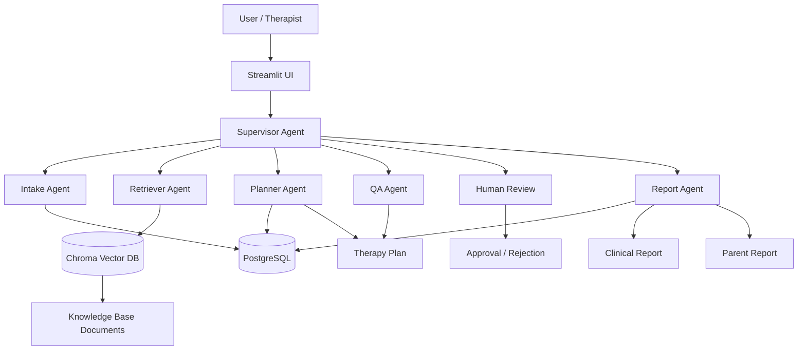

# Hospital Copilot

Hospital Copilot is an AI-assisted clinical workflow application for pediatric occupational therapy planning. It combines a Streamlit frontend, LangGraph-based agent orchestration, Groq LLMs, a retrieval-augmented knowledge base, and PostgreSQL persistence to help generate, review, and document therapy plans.

## Overview

The project takes a patient intake description, extracts structured patient information, retrieves relevant clinical guidelines from a local knowledge base, generates a therapy plan, runs a QA review, and produces clinical and parent-friendly reports.

This repository is designed for a hospital-style workflow where a therapist or clinician can:

- create or search for a patient record
- review prior therapy plans
- generate a new therapy plan
- approve or reject the plan
- export professional reports

## Key Features

- Streamlit web app for interactive patient assessment and plan review
- Multi-agent workflow powered by LangGraph
- Structured extraction of patient demographics and concerns
- RAG-based retrieval from therapy guideline documents
- Automated therapy plan generation
- QA review for plan quality and consistency
- Report generation for clinicians and parents
- Patient and therapy plan persistence in PostgreSQL

## Architecture Diagram



## Technology Stack

- Python 3.14+
- Streamlit for the web interface
- LangGraph for multi-agent orchestration
- LangChain for LLM and document processing workflows
- Groq LLM models for structured generation and review
- Chroma vector database for retrieval-augmented search
- HuggingFace sentence-transformers embeddings
- PostgreSQL for storing patients, plans, and reports
- ReportLab / PDF utilities for document generation
- python-dotenv for environment configuration

## Agents Used

- Supervisor Agent: routes the workflow between stages and decides the next action.
- Intake Agent: extracts structured patient profile data from free-form input.
- Retriever Agent: searches the knowledge base for relevant clinical guidelines.
- Planner Agent: generates a structured therapy plan with goals, weekly schedule, and home activities.
- QA Agent: evaluates the plan for completeness, consistency, and clinical soundness.
- Human Review Agent: allows manual approval or rejection before final reporting.
- Report Agent: generates clinician-facing and parent-friendly reports.

## Project Structure

- app.py — Streamlit web interface
- main.py — command-line entry point for running the workflow
- ingest.py — loads guideline text files into the vector store
- agents/ — LangGraph agent implementations
  - intake.py
  - retriever.py
  - planner.py
  - qa.py
  - human_review.py
  - report.py
  - supervisor.py
- graph/ — workflow and state definitions
- tools/ — database and retrieval helpers
- utils/ — PDF/reporting utilities
- data/ — source therapy guideline documents
- chroma_db/ — vector database storage

## Prerequisites

- Python 3.14+ (as declared in pyproject.toml)
- PostgreSQL running locally
- A Groq API key
- Internet access for model and embedding downloads

## Environment Setup

1. Create and activate a virtual environment:

   ```bash
   python -m venv .venv
   source .venv/bin/activate
   ```

   On Windows PowerShell:

   ```powershell
   python -m venv .venv
   .\.venv\Scripts\Activate.ps1
   ```

2. Install dependencies:

   ```bash
   pip install -e .
   ```

3. Create a .env file with your Groq credentials:

   ```env
   GROQ_API_KEY=your_groq_api_key
   ```

4. Make sure PostgreSQL is available and create a database named hospital_copilot.

## Database Setup

The application expects PostgreSQL tables such as:

```sql
CREATE TABLE patients (
    id SERIAL PRIMARY KEY,
    name TEXT NOT NULL,
    age INTEGER NOT NULL,
    diagnosis TEXT NOT NULL,
    concerns TEXT
);

CREATE TABLE therapy_plans (
    id SERIAL PRIMARY KEY,
    patient_id INTEGER REFERENCES patients(id),
    plan JSONB,
    created_at TIMESTAMP DEFAULT CURRENT_TIMESTAMP
);

CREATE TABLE reports (
    id SERIAL PRIMARY KEY,
    patient_id INTEGER REFERENCES patients(id),
    report_type TEXT NOT NULL,
    report_content TEXT NOT NULL,
    created_at TIMESTAMP DEFAULT CURRENT_TIMESTAMP
);
```

Update the database connection details in tools/db_tools.py if your local PostgreSQL configuration differs.

## Knowledge Base Ingestion

The knowledge base is built from the text files in the data directory.

Run:

```bash
python ingest.py
```

This will:

- load all .txt files from data/
- split them into chunks
- create or update the Chroma vector store in chroma_db/

## Running the Web App

Start the Streamlit application:

```bash
streamlit run app.py
```

The app provides a patient management sidebar, patient search, plan generation workflow, and report review experience.

## Running the CLI Version

You can also run the workflow from the terminal:

```bash
python main.py
```

This prompts for patient details and runs the same agent pipeline in a console-based flow.

## Usage Flow

A typical session looks like this:

1. Enter or search for a patient.
2. Provide patient details and concerns.
3. The system extracts the profile.
4. Relevant therapy guidelines are retrieved.
5. A therapy plan is generated.
6. The plan is reviewed for major clinical issues.
7. The user approves or rejects the plan.
8. Clinical and parent reports are produced.

## Notes

- The project uses local vector search via Chroma, so the ingestion step should be run before the first retrieval.
- The app depends on the knowledge base documents under data/ for guidance quality.
- Report generation and plan generation rely on Groq-hosted models, so a valid API key is required.

## License

This project is for internal or educational use unless otherwise specified by the repository owner.
